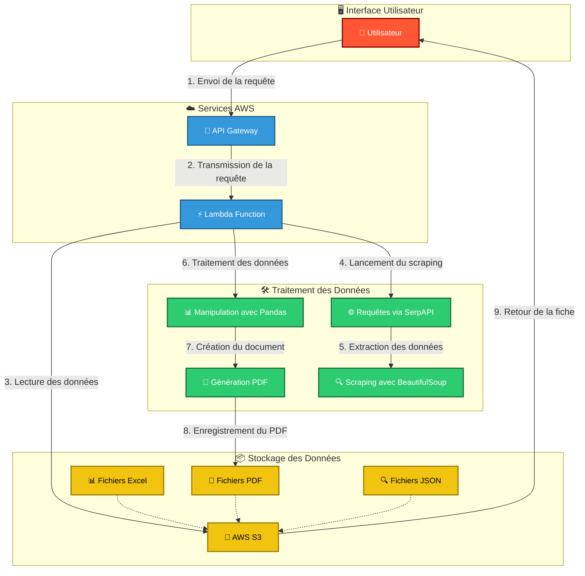

# 🏗️ Architecture du projet Hackaton

Ce diagramme représente l’architecture de notre projet de génération automatique de fiches clients.

Explication du flux
Saisie du nom → L’utilisateur entre le nom de la commune, du département ou de la région.  

Envoi de la requête → Streamlit transmet la requête à l’API Gateway.  

Transmission de la requête → L’API Gateway déclenche la fonction Lambda.  

Lecture des données → La fonction Lambda accède aux fichiers stockés sur S3.  

Lancement du scraping → Si les données ne sont pas disponibles, la recherche est lancée via SerpAPI.  

Extraction des données → BeautifulSoup extrait les informations utiles depuis les sources en ligne.  

Traitement des données → Pandas transforme et analyse les données récupérées.  

Création du document → Le fichier PDF de la fiche client est généré.  

Enregistrement du PDF → La fiche est sauvegardée dans AWS S3.  

Retour de la fiche → La fiche est transmise à l’interface Streamlit.  

Affichage du résultat → L’utilisateur voit la fiche client générée  
