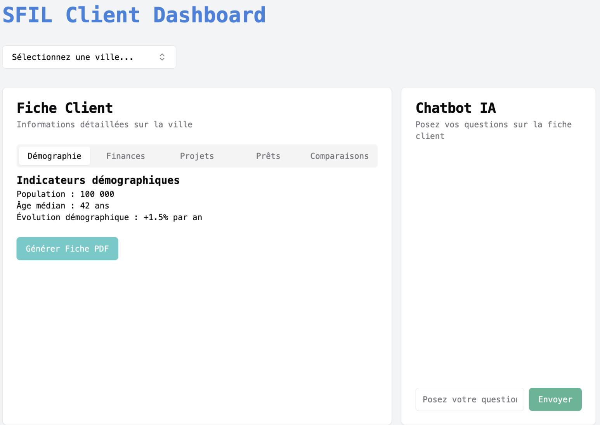

# SFIL Hackathon – Automated Client Profiling for Public Entities

Built in 48h during a GenAI hackathon (Sia Partners).

**Team:** Erwan Ouabdesselam, Kevin Wardakhan, Faycal Benaissa, Amine Rouibi, Sami Hernoune, Mohamed Zouad

## Overview

Designed an end-to-end pipeline to automatically generate structured client profiles for French public entities (SPL), using heterogeneous public data sources.

The system retrieves, processes and synthesizes financial, institutional and contextual data to produce decision-ready reports.

## Results

- Reduced manual client profiling from several hours to a few minutes
- Automated aggregation and structuring of multi-source public data
- Enabled faster comparison of public entities through standardized reports

## Demo

## Key Challenges

- Aggregating highly fragmented public data (data.gouv, PDFs, web sources)
- Handling inconsistent / incomplete information across entities
- Structuring unstructured text into usable insights
- Ensuring factual consistency in generated outputs

## Approach

- **Data ingestion**: APIs (data.gouv, Wikipedia) + scraping (PDF, web)
- **Preprocessing**: cleaning and normalization with Pandas
- **RAG pipeline**:
  - Retrieved relevant documents from multi-source corpus
  - Used LLM (Mistral) conditioned on retrieved context
  - Reduced hallucinations and improved factual grounding
- **Infrastructure**: AWS Lambda + S3 (serverless pipeline)
- **Interface**: Streamlit dashboard with dynamic report generation

## Features

- Automated generation of structured client reports (PDF export)
- Multi-source data enrichment (financial + contextual)
- Retrieval-Augmented Generation for grounded summaries
- Chatbot interface to query generated reports
- Integration of ELECTRE method for multi-criteria ranking

## Tech Stack

Python · Pandas · AWS Lambda · S3 · Mistral AI · BeautifulSoup · Streamlit

## Limitations

- Retrieval quality depends on document relevance
- Some PDF parsing pipelines remain brittle
- ELECTRE integration still partial in UI

